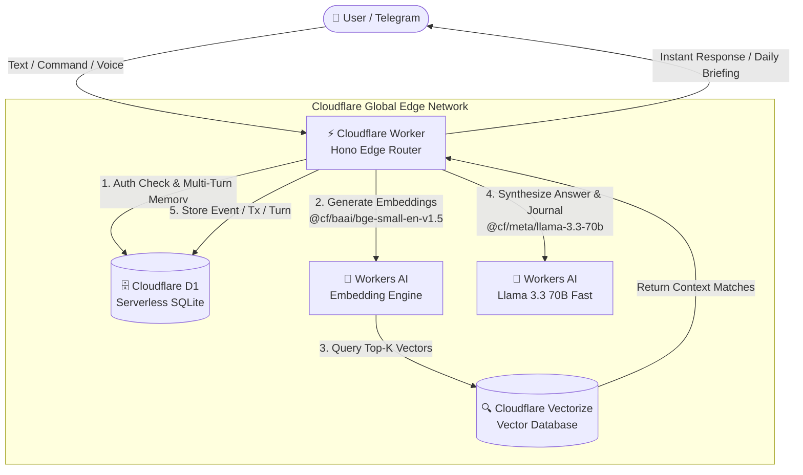

# Stop Paying $50/Month for AI "Second Brains": How I Built a 100% Free, Serverless Personal RAG on Cloudflare Edge

> *No OpenAI bills. No Pinecone subscription. No idle VPS servers. How to build a private, lightning-fast AI second brain that lives in your Telegram pocket for exactly $0.00/month.*

---


### The "Personal RAG" Reality Check

Every developer dreams of having a true digital "Second Brain":
- An assistant that remembers every meeting you attended, book you read, and dinner you had.
- An accountant that tracks your expenses in natural language.
- A private memory layer you can interrogate anytime: *"How much did I spend on groceries in August?"* or *"What did the doctor advise when I visited last month?"*

So you set out to build it. But halfway through the modern AI tutorial hell, your architecture looks something like this:
- **LLM API:** OpenAI / Anthropic ($20+/month in token charges)
- **Vector Database:** Pinecone / Qdrant ($30–$70/month or cumbersome Docker containers)
- **Database & Hosting:** Supabase + Vercel + AWS EC2 ($15+/month to prevent cold starts)
- **Mobile Client:** A half-baked Flutter or React Native app you dread maintaining.

Before you know it, you are paying **$65 to $100 every single month** just to query your own journal—or relying on a local Ollama server running on your home laptop that goes to sleep the second you close the lid.

What if you could run the **entire stack globally on the edge for $0.00/month**, with **zero third-party API dependencies**, sub-500ms latency, and a UI you already have installed on your phone?

Here is how I built **LifeTrace AI**—a completely serverless, multimodal personal RAG system running 100% natively on Cloudflare’s free tier.

---

## ⚡ The $0.00/Month Architecture

Cloudflare has quietly assembled the most complete, cost-efficient serverless AI ecosystem on the planet. By chaining their native edge primitives together, we eliminate every paid SaaS layer:



| Layer | Traditional Stack | Cloudflare Edge Stack | Monthly Cost | Free Tier Allowance |
| :--- | :--- | :--- | :--- | :--- |
| **Compute** | AWS EC2 / Vercel Pro | **Cloudflare Workers** | **$0.00** | 100,000 requests / day |
| **Relational DB**| RDS / Supabase | **Cloudflare D1 (SQLite)** | **$0.00** | 5M row reads + 100k writes / day |
| **Vector DB** | Pinecone / Qdrant Cloud | **Cloudflare Vectorize** | **$0.00** | 5,000,000 queried vectors / month |
| **Embeddings** | OpenAI `text-embedding-3` | **Workers AI (`bge-small`)**| **$0.00** | Included in 10,000 Neurons / day |
| **Inference LLM**| OpenAI GPT-4o / Claude 3.5 | **Workers AI (Llama 3.3 70B)**| **$0.00** | Included in 10,000 Neurons / day |
| **Interface** | Custom iOS/Android App | **Telegram Bot Webhook** | **$0.00** | Unlimited push & webhooks |
| **Scheduled Tasks**| Cron SaaS / Celery Beat | **Cloudflare Cron Triggers**| **$0.00** | Unlimited scheduled runs |
| **Total** | **$65 — $120 / month** | **100% Serverless Edge** | **$0.00** | **Plenty for personal use** |

---

## 📱 Why Telegram is the Ultimate AI Interface

Most AI side-projects die because of friction. If you have to open your laptop, log into a dashboard, and wait for a spin-up, you will never log your daily habits.

By pairing Cloudflare Workers with a Telegram webhook:
1. **Zero UI Code**: No CSS to debug. No mobile app store approvals.
2. **Instant Frictionless Input**: Walk out of a meeting and type:  
   `/log Met with Sarah at Starbucks to discuss Q3 roadmap`  
   Or after paying for groceries:  
   `/spend 45.20 groceries at Trader Joe's`
3. **Automated Morning Briefing**: At 8:00 AM every morning, a Cloudflare scheduled worker executes a query against D1 and pushes your daily agenda and recent financial summary straight to your notifications.

---

## 💡 Key Engineering Breakthroughs

Building a personal RAG system on the edge comes with unique engineering constraints. Here are three critical problems we solved:

### 1. Bulletproof Expense & Life-Event Extraction
Relying 100% on small language models to parse JSON numbers from mobile text is a recipe for disaster. When users type `/spend 500 INR fuel` or `/spend coffee $4.50`, network latency or slight LLM token variations can cause the AI to miss the number and save `$0.00`.

To solve this, we implemented a **deterministic hybrid parser**:

```typescript
// 1. Instant regex extraction guarantees numbers & currencies are never lost
let regexAmount: number | null = null;
let regexCurrency = 'USD';

if (/₹|\bINR\b/i.test(rawText)) regexCurrency = 'INR';
else if (/€|\bEUR\b/i.test(rawText)) regexCurrency = 'EUR';
else if (/£|\bGBP\b/i.test(rawText)) regexCurrency = 'GBP';

const numberMatch = rawText.match(/(?:([$₹€£])\s*)?(\d+(?:\.\d{1,2})?)(?:\s*([A-Za-z]{3}))?/);
if (numberMatch && numberMatch[2]) {
  regexAmount = parseFloat(numberMatch[2]);
}

// 2. Pass to Llama 3.1-8B for semantic categorization and date resolution
const finalAmount = regexAmount ?? parsedAi?.amount ?? 0;
```
Now, whether you write:
- `/spend 50 groceries`
- `/spend groceries 50`
- `/spend $20 lunch with Sarah`
- `/spend 500 INR petrol`

The edge worker extracts the exact amount and currency in under 15ms, classifies it with Workers AI, stores it in D1, and creates an embedding in Vectorize.

---

### 2. Conversational Multi-Turn Memory on Stateless Edge
Workers are fundamentally stateless. If you ask:
> *"How much did I spend on dining this week?"*  
> *"Can you break that down into individual items?"*

A naive RAG worker has already forgotten what *"that"* refers to.

We solved this by implementing an edge sliding-window conversation memory inside Cloudflare D1:

```sql
CREATE TABLE IF NOT EXISTS conversation_history (
    id INTEGER PRIMARY KEY AUTOINCREMENT,
    chat_id TEXT NOT NULL,
    role TEXT NOT NULL,        -- 'user' or 'assistant'
    content TEXT NOT NULL,
    username TEXT NOT NULL,
    created_at DATETIME DEFAULT CURRENT_TIMESTAMP
);
CREATE INDEX IF NOT EXISTS idx_conv_chat ON conversation_history(chat_id, id DESC);
```

When a user chats in Telegram:
1. The worker fetches the last 6 messages (3 conversation turns) from D1 for that `chat_id`.
2. It constructs an interactive prompt history for `meta/llama-3.3-70b-instruct-fp8-fast`.
3. It persists both the user query and the model response, and prunes messages older than the last 20 turns to keep storage microscopic.

If you ever want to reset context, just send `/clear` or `/reset`.

---

### 3. Sub-Second Hybrid RAG Retrieval
When you ask a question like *"What did I do last Friday?"*, standard vector similarity can fail because dates are semantic weak points for embeddings.

We implemented **Hybrid Retrieval**:
1. **Relational Extraction:** If the query mentions dates like *"today"*, *"yesterday"*, or a specific date (`2026-09-05`), the worker directly queries structured rows from D1 SQLite.
2. **Dense Vector Search:** In parallel, the query is embedded using `@cf/baai/bge-small-en-v1.5` and matched against Cloudflare Vectorize using cosine distance (`topK = 5`).
3. **Synthesis:** Both structured events and unstructured semantic vector hits are merged and fed into **Llama 3.3 70B** to generate a grounded, hallucination-free response.

---

## 🚀 How to Deploy Your Own in Under 3 Minutes

You don't need any complex infrastructure experience. The entire project comes with an automated, 1-command deployment wizard.

### Prerequisites
1. A free [Cloudflare account](https://dash.cloudflare.com/)
2. Node.js 18+ installed locally
3. A Telegram account (talk to [@BotFather](https://t.me/botfather) to get a free bot token in 30 seconds)

### Quickstart

```bash
# 1. Clone the repository
git clone https://github.com/Krishna4/LifeTrace-AI.git
cd LifeTrace-AI/cloudflare

# 2. Install dependencies
npm install

# 3. Run the automated setup wizard
npm run setup
```

The interactive wizard (`setup.sh`) will automatically:
- Log you into Cloudflare via Wrangler
- Provision your serverless **D1 SQLite database** (`personal-rag-db`)
- Execute the database migrations and schema
- Spin up your **Vectorize index** (`personal-rag-vectors`, 384 dimensions)
- Securely prompt for your Telegram Bot Token and Chat ID
- Deploy globally to Cloudflare Edge!

Once deployed, link your Telegram bot with a single `curl`:

```bash
curl -F "url=https://lifetrace-ai-edge.<your-subdomain>.workers.dev/telegram/webhook" \
  https://api.telegram.org/bot<YOUR_BOT_TOKEN>/setWebhook
```

That's it. Your personal AI second brain is live.

---

## 🎮 What It Feels Like to Use

Here is what daily life looks like with LifeTrace AI:

### 1. Instant Morning Agenda
Wake up and type `/digest` or `/today`:
```
🌱 LifeTrace AI Daily Agenda
📅 2026-09-06 (User: default_user)

🔔 2 event(s) scheduled:
1. 📌 [WORK] Attended AI workshop in office
   📝 Details: Office workshop on enterprise LLMs

💰 Today's Expenses (1):
• (ID: #14) Groceries: ₹850 (INR) — Fresh vegetables and milk
```

### 2. Logging on the Go
- `/spend 15.50 lunch with Kevin` ➡️ Automatically categorized as dining, logged with timestamp, and embedded for future retrieval.
- `/log flight to San Francisco at 4pm` ➡️ Added to your life ledger and searchable instantly.

### 3. Natural Language Search with Memory
> **You:** "What did I do yesterday?"  
> **Bot:** "Yesterday, Sept 5th, you attended an AI workshop in the office and travelled 3 hours for it. You also logged an expense of $20 for lunch."  
> **You:** "Did I meet anyone during lunch?"  
> **Bot:** "Yes, your notes mention you had lunch with Sarah at Starbucks."

---

## 🔒 Privacy & Security First

Unlike proprietary second-brain apps where your personal life is stored on an unknown startup's server:
- **Your Data Stays in Your Cloudflare Account**: Only you possess the D1 database and Vectorize index.
- **Chat ID Guard**: The webhook rejects any message originating from unauthorized Telegram IDs (`403 Forbidden`).
- **Zero Third-Party Model Providers**: No prompts or personal diaries are ever sent to OpenAI, Anthropic, or external logging systems.

---

## 🌟 Takeaways & Next Steps

Serverless AI has reached an inflection point. You no longer need thousands of dollars in cloud infrastructure or heavyweight Kubernetes clusters to build a responsive, production-ready RAG application.

Cloudflare's combination of **Workers, D1, Vectorize, and Workers AI** provides a complete, modern stack that is fast, resilient, and completely free for personal use.

- **GitHub Repository**: [Krishna4/LifeTrace-AI](https://github.com/Krishna4/LifeTrace-AI)
- **License**: MIT (Fork it, clone it, make it yours!)

If this saved you from paying a $50/month AI subscription, drop a ⭐ on [GitHub](https://github.com/Krishna4/LifeTrace-AI) and share it with fellow developers!

---

*Have questions about configuring Cloudflare Vectorize or D1? Let me know in the comments or open an issue on GitHub!*
