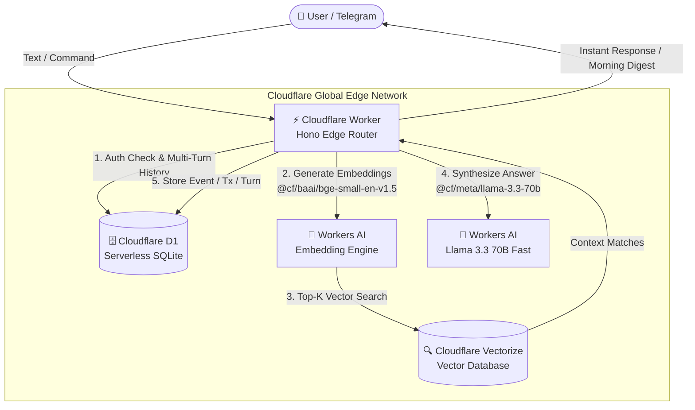

# 🧠 LifeTrace AI Edge — 100% Free Serverless Personal RAG & Telegram Life Ledger

[](https://opensource.org/licenses/MIT)
[](https://workers.cloudflare.com/)
[](https://developers.cloudflare.com/d1/)
[](https://developers.cloudflare.com/vectorize/)
[](https://developers.cloudflare.com/workers-ai/)
[](https://core.telegram.org/bots/api)

> **A completely private, zero-dollar ($0.00/month) AI "Second Brain" and Life Ledger that lives in your pocket.**  
> Powered 100% natively by Cloudflare's serverless edge ecosystem: **Cloudflare Workers, D1 (SQLite), Vectorize, and Workers AI (Llama 3.3 70B & BGE-Small)**. No OpenAI bills. No Pinecone subscriptions. No idle servers.

---

## ✨ Features

- 💸 **$0.00 / Month Forever**: Runs 100% within Cloudflare’s generous daily free limits (100k requests/day, 5M DB reads/day, 5M queried vectors/month, 10k AI neurons/day).
- 📱 **Frictionless Telegram Interface**: No web dashboard to build or mobile app to maintain. Text or voice your notes, meetings, and expenses right from Telegram.
- 💰 **Bulletproof Expense Tracking**: Hybrid deterministic regex + SLM parsing accurately extracts amounts, currencies (`$`, `₹`, `€`, `£`, `USD`, `INR`), and vendors regardless of word order (`/spend 50 groceries`, `/spend $20 lunch`, `/spend 500 INR fuel`).
- 📅 **Daily Morning Briefings**: Automated Cloudflare Cron trigger pushes your daily agenda and financial summary to Telegram every morning.
- 🧠 **Multi-Turn Conversational Memory**: Remembers previous turns for natural follow-up questions (*"How much did I spend on dining?"* followed by *"Can you break that down?"*).
- 🔍 **Sub-Second Hybrid RAG**: Merges relational SQLite lookups (for exact dates) with dense vector similarity search (Vectorize + BGE-Small) and synthesizes answers via **Llama 3.3 70B**.
- 🛡️ **Private & Secure**: Only accessible by your whitelisted Telegram Chat ID (`403 Forbidden` for everyone else) with optional Bearer API Key guards for REST endpoints.

---

## 🏗️ Architecture



---

## ⚡ Quick Start: 1-Command Automated Setup Wizard

You can deploy your own private instance in **under 2 minutes**:

```bash
# 1. Clone this repository
git clone https://github.com/Krishna4/LifeTrace-AI-Edge.git
cd LifeTrace-AI-Edge

# 2. Install dependencies
npm install

# 3. Run the interactive setup wizard
npm run setup
```

The interactive wizard (`setup.sh`) will automatically:
1. Authenticate with your Cloudflare account via Wrangler.
2. Create your serverless **Cloudflare D1 Database** (`personal-rag-db`).
3. Apply all database tables, indexes, and migrations from `schema.sql`.
4. Create your **Cloudflare Vectorize Index** (`personal-rag-vectors`, 384 dimensions, cosine metric).
5. Prompt for your Telegram credentials (`TELEGRAM_BOT_TOKEN`, `TELEGRAM_CHAT_ID`, `API_KEY`).
6. Deploy your worker globally to Cloudflare Edge!

Once deployed, link your Telegram bot with a single command:
```bash
curl -F "url=https://<your-worker-name>.<your-subdomain>.workers.dev/telegram/webhook" \
  https://api.telegram.org/bot<YOUR_BOT_TOKEN>/setWebhook
```

---

## 🛠️ Manual Step-by-Step Setup

If you prefer provisioning resources manually:

### 1. Copy Configuration Template
```bash
cp wrangler.toml.example wrangler.toml
```

### 2. Create D1 Database & Execute Schema
```bash
npx wrangler d1 create personal-rag-db
# Copy the printed database_id into wrangler.toml under [[d1_databases]] database_id

npx wrangler d1 execute personal-rag-db --file=schema.sql --remote
```

### 3. Create Vectorize Index
```bash
npx wrangler vectorize create personal-rag-vectors --dimensions=384 --metric=cosine
```

### 4. Set Secrets & Auth Guards
```bash
npx wrangler secret put TELEGRAM_BOT_TOKEN
npx wrangler secret put TELEGRAM_CHAT_ID
npx wrangler secret put API_KEY # Optional API guard for /api/v1/*
```

### 5. Deploy to Cloudflare Edge
```bash
npx wrangler deploy
```

---

## 📲 Telegram Command Cheat Sheet

| Command | Example | Description |
| :--- | :--- | :--- |
| `/today` or `/digest` | `/today` or `/digest` | Displays today's agenda: scheduled events, meetings, and today's expenses. |
| `/today <date>` | `/today 2026-09-07` | Views agenda and expenses for any specific date (`YYYY-MM-DD`). |
| `/spend <amount> <item>` | `/spend 50 groceries`<br>`/spend $20 lunch`<br>`/spend 500 INR fuel` | Logs financial transaction with automatic amount, currency, and merchant extraction. |
| `/log <details>` | `/log AI workshop at office 10am` | Logs a life event, meeting, travel, or diary entry. |
| `/events` | `/events` | Lists your 5 most recent life events with their IDs. |
| `/expenses` | `/expenses` | Lists your 5 most recent transactions with their IDs. |
| `/delete <id>` | `/delete 5` | Deletes an event by ID and purges its vector embedding. |
| `/delete_expense <id>` | `/delete_expense 2` | Deletes a financial transaction by ID. |
| `/clear` or `/reset` | `/clear` | Clears conversation memory to start a fresh discussion topic. |
| `/help` or `/start` | `/help` | Displays the interactive command menu in Telegram. |

### 💬 Natural Conversational Search (with Memory!)
You don't even need commands — just chat naturally:
- *"What did I do yesterday?"*
- *"How much did I spend on food this week?"*
- *"Can you list those expenses by vendor?"* (Remembers previous context!)

---

## 📡 REST API Reference

All REST endpoints support optional `Authorization: Bearer <API_KEY>` or `X-API-Key: <API_KEY>` authentication:

- `GET /` — Service health & Cloudflare bindings status
- `POST /api/v1/query` — Multimodal RAG query (`{ "query": "What did I do today?" }`)
- `GET /api/v1/events` — Fetch recent events with optional `?date=YYYY-MM-DD` filter
- `POST /api/v1/events` — Create and embed an event
- `GET /api/v1/transactions` — Fetch recent financial transactions
- `POST /api/v1/transactions` — Create and embed a transaction
- `POST /api/v1/telegram/publish-digest` — Manually trigger the morning briefing

---

## 📄 License

MIT © [Murali Krishna](https://github.com/Krishna4)
